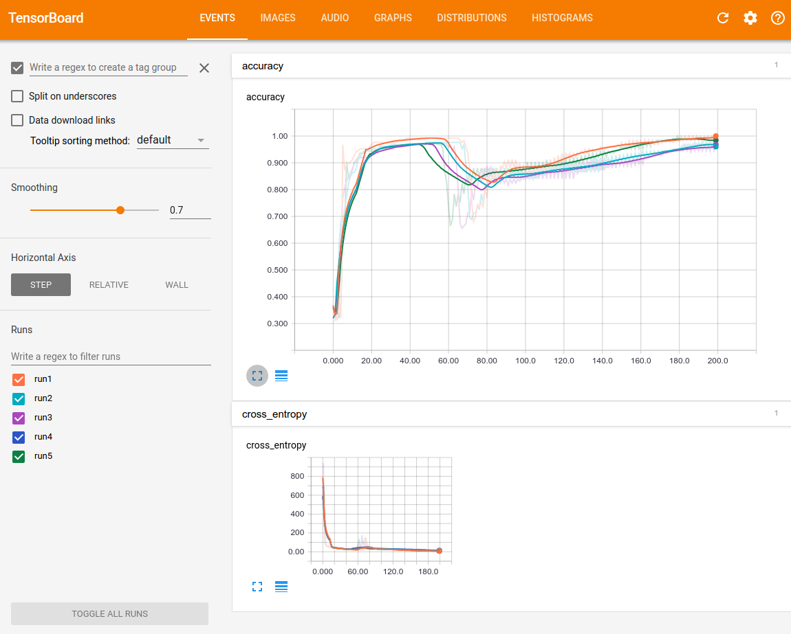

# Tutorial on basic usage of TensorFlow

Some basic usage:
* Constants, Variables, Placeholders
* Example on Model Building and Training
* Tracking accuracy and loss function during training and visualizing them using TensorBoard



More resources and examples (on MNIST), if you are still struggling:
* Logistic Regression [sample code](https://github.com/dianaborsa/TensorFlow_Examples/blob/master/ex1_logistic_regression.py)
* NN [sample code](https://github.com/dianaborsa/TensorFlow_Examples/blob/master/ex2_nn.py)
* Saving and loading/restoring a model [sample code](https://github.com/dianaborsa/TensorFlow_Examples/blob/master/ex2_nn_save_model.py)
* Saving summary variables to visualize in TensorBoard [sample code](https://github.com/dianaborsa/TensorFlow_Examples/blob/master/ex2_nn_tensorboard.py)

Note: These are a bit old, so there might have bit some changes in syntax in more recent version of TF. Let us know, if you have any trouble with them. 

### Dependencies
```
tensorflow
numpy
tensorboard
```

Also a working installation of ipython/jupyter.

### Download

Clone/Fork repository:
```
>> git clone https://github.com/compgi13/tutorial.git
```

Go to the folder and start a session:
```
>> cd tutorial
>> ipython notebook
```

Select the notebook you want and run through the tutorial.

